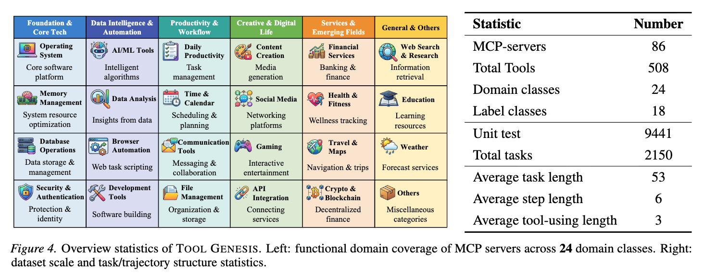
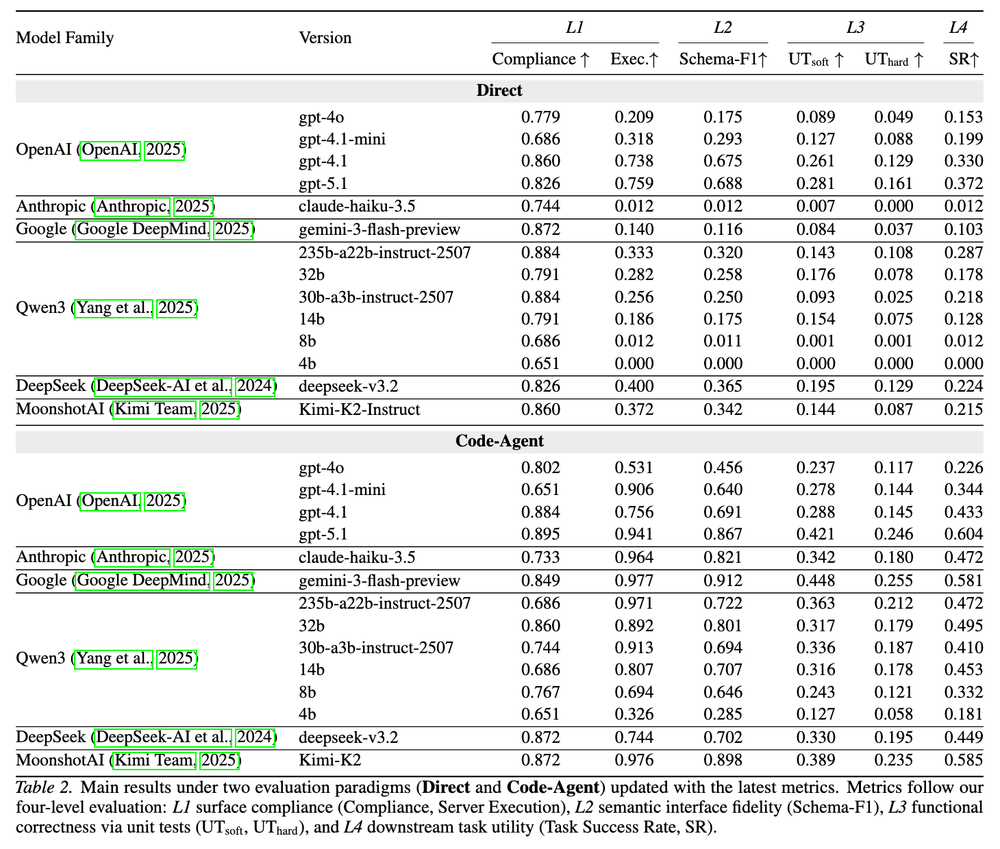

# Tool-Genesis: A Task-Driven Tool Creation Benchmark for Self-Evolving Language Agent

[Project Page](https://tool-genesis.github.io) | [Code](https://github.com/Tool-Genesis/Tool-Genesis) | [Dataset](https://huggingface.co/datasets/tool-genesis/Tool-Genesis-Benchmark) | [Model](https://huggingface.co/tool-genesis/Tool-Genesis-Qwen3-8B-SFT) | [License](LICENSE)

Tool-Genesis is a diagnostic benchmark for evaluating whether language agents can construct reusable MCP (Model Context Protocol) tools from abstract requirements, without pre-defined tool specifications.

Unlike outcome-only evaluation, Tool-Genesis measures the full tool creation pipeline and exposes where failures occur: interface compliance, schema fidelity, executable correctness, and downstream task utility.

## Table of Contents

- [Overview](#overview)
- [Benchmark At A Glance](#benchmark-at-a-glance)
- [Data Coverage](#data-coverage)
- [Main Results](#main-results)
- [Quick Start](#quick-start)
- [Generation Strategies](#generation-strategies)
- [Repository Structure](#repository-structure)
- [Model And Backend Support](#model-and-backend-support)
- [Journal Extension Experiments](#journal-extension-experiments)
- [Citation](#citation)
- [License](#license)

## Overview

Given a scenario description, an agent must generate a runnable MCP server including tool schemas and implementation code. The generated server is then evaluated in four levels:

| Level | What it tests | Metrics |
|---|---|---|
| L1: Protocol Compliance | JSON format validity and launch success | Compliance, Exec. |
| L2: Semantic Correctness | Schema fidelity and positive unit tests | Schema-F1, UT_soft |
| L3: Capability Boundary | Negative and boundary robustness | UT_hard |
| L4: Task Utility | Downstream task completion with generated tools | Success Rate |

This evaluation protocol decouples tool creation quality from tool usage strategy, making failure attribution more explicit.

## Benchmark At A Glance

| Statistic | Value |
|---|---|
| MCP servers | 86 |
| Total tools | 508 |
| Domain classes | 24 |
| Label classes | 18 |
| Unit tests | 9441 |
| Total tasks | 2150 |
| Average task length | 53 |
| Average step length | 6 |
| Average tool-using length | 3 |

## Data Coverage

Drop your dataset overview figure at:

- `assets/figure_dataset_overview.png`

Then it will render below.



## Main Results

Drop your main results figure/table at:

- `assets/table_main_results.png`

Then it will render below.



## Quick Start

### 1) Environment Setup

```bash
conda create -n toolgenesis python=3.10 -y
conda activate toolgenesis
pip install -r requirements.txt
```

### 2) Configure Environment Variables

```bash
cp .env.template .env
# At minimum, set OPENAI_API_KEY and OPENAI_BASE_URL.
```

### 3) Configure Models

Edit `scripts/run_benchmark/generate_mcp.sh` and set your `PLATFORM_MODELS` list:

```bash
PLATFORM_MODELS=(
  "OPENAI:openai/gpt-4.1-mini,openai/gpt-4.1"
  "OPENAI:anthropic/claude-sonnet-4"
)
```

### 4) Generate MCP Servers

```bash
bash scripts/run_benchmark/generate_mcp.sh
```

### 5) Run Evaluation

```bash
bash scripts/run_benchmark/run_evaluation.sh
```

### 6) Summarize Results

```bash
python scripts/run_benchmark/summarize_results.py --path temp/eval_results_v3
```

## Generation Strategies

| Strategy | Description |
|---|---|
| Direct | Single-call generation of schema and code |
| Coder-Agent | Iterative multi-turn generation with sandbox-assisted coding |

## Repository Structure

```text
Tool-Genesis/
├── src/
│   ├── core/                 # Agent framework, sandbox, toolkits, model interfaces
│   ├── apps/                 # MCP server factory, file system apps, test client
│   ├── env_generation/       # Tool generation strategies
│   ├── env_evalution/        # Four-level evaluation pipeline
│   └── utils/                # Shared utilities
├── scripts/
│   ├── run_benchmark/        # Generate and evaluate scripts
│   ├── build_benchmark/      # Dataset construction pipeline
│   ├── experiment_journal/   # Journal extension experiments
│   └── plot/                 # Plotting scripts
├── data/
│   └── tool_genesis_v3.json  # Benchmark dataset
├── requirements.txt
├── .env.template
└── TODO.md
```

## Model And Backend Support

The framework supports multiple backends through a unified LLM calling layer, including:

- OpenAI (and OpenAI-compatible endpoints)
- Bailian
- OpenRouter
- DeepSeek
- vLLM

Configure provider credentials in `.env`.

## Journal Extension Experiments

Additional journal-track experiments are tracked under `scripts/experiment_journal/` and `TODO.md`.

| Experiment | Description | Status |
|---|---|---|
| A: Tool Reusability | Whether generated tools generalize to unseen tasks | Needs fix |
| B: Multi-Round Evolution | Whether iterative feedback improves tools | Needs fix |
| C: Error Taxonomy | Failure type analysis across L1-L4 | Needs fix |
| D: Toolset Completeness | Coverage of required tool set | Done |
| E: Oracle Ablation | Isolate schema error vs code error | Framework ready |

## Citation

```bibtex
@misc{tool_genesis_2025,
  title={Tool-Genesis: A Task-Driven Tool Creation Benchmark for Self-Evolving Language Agent},
  author={Xia, Bowei and Hu, Mengkang and Wang, Shijian and Jin, Jiarui and Jiao, Wenxiang and Lu, Yuan and Li, Kexin and Luo, Ping},
  year={2025},
  note={Project page: https://tool-genesis.github.io}
}
```

Replace this entry with the final publication metadata once available.

## License

Apache License 2.0. See [LICENSE](LICENSE).
